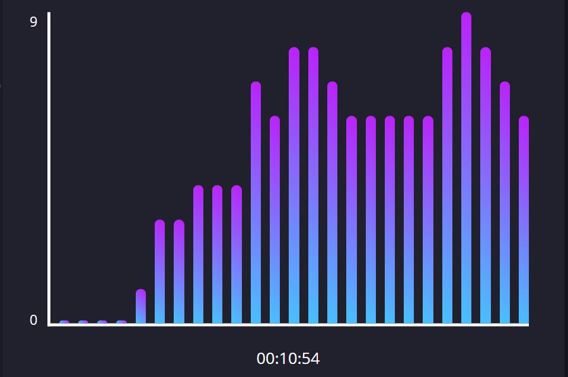

<h1 align="center">
  <a href="http://liteboard.io/">
    Liteboard.io
  </a>
</h1>
<p align="center">
  <a href="https://github.com/jeverd/lecture-experience/graphs/contributors" alt="Contributors">
        </a>
  <a href="https://github.com/jeverd/lecture-experience/blob/master/LICENSE">
    
  </a>
  <a href="https://circleci.com/">
    
  <a href="https://github.com/jeverd/lecture-experience/pulse" alt="Activity">
        </a>
  </a>
  <a href="https://github.com/jeverd/lecture-experience">
    
  </a>
  <a href="https://discord.gg/BH4akDY">
        </a>
  </a>
</p>

Liteboard is a free, browser-based lecturing platform for anyone who wants to quickly setup a real-like classroom with State-of-the-Art drawing tools and webcam/audio broadcasts. We don't support cumbersome setups; no downloads or accounts required! Just create a lecture, and share the link. It's really that simple.

<div style="margin: 5px 0px;">
  
</div>

Liteboard is powered by WebRTC and uses the [Janus](https://github.com/meetecho/janus-gateway) implementation of a Selective Forwarding Unit (SFU) to allow multiple participants per lecture while ensuring the lowest latency available on browsers. We host our own TURN server to guarantee support for users in any kind of network.


## Contents


- [Contents](#contents)
- [💡 Features](#-features)
- [📝 Requirements](#-requirements)
- [🏃 Getting Started](#-getting-started)
    - [Clone](#clone)
    - [Setup](#setup)
- [🌲 Environment Variables](#-environment-variables)
- [🔊 Contributing](#-contributing)
- [✨ Team](#-team)


## 💡 Features
  
  

  - Live audio/video transmissions
  - High Quality live drawing boards
  - Chat rooms supporting text and attachments
  - Quick-to-setup lectures - no download or accounts
  - SFU infrastucture allowing multiple attendees
  - Lecture metrics with graphical interface
  - i18n - Portuguese | English

## 📝 Requirements

To run liteboard locally, you will need the following:
   - [Node](https://nodejs.org/en/download/)
   - [Docker and Docker compose](https://docs.docker.com/get-docker/)


## 🏃 Getting Started
##### Clone
- Clone this repo by running the following command `git clone https://github.com/jeverd/lecture-experience.git`

#### Setup
- Starting up docker containers
> generating janus configuration file
```shell
    cd docker/docker-config
    cp janus/example_janus.jcfg janus/janus.jcfg # if you want play with janus configs, do it in janus.jcfg
```
> now we can start up our `janus` and `redis` containers
```shell
    cd .. # assuming you are in the docker-config directory
    docker-compose up -d  # this will start up redis and janus containers
```
- Installing dependencies
> now navigate to the root directory and install npm packages
```shell
    npm install 
```
- Creating `.env` file
> navigate to the config directory, create `.env` file, and then copy contents of `example.dev.env` into the file
```shell
    cd config # assuming you are in root directory
    cp example.dev.env .env  #more info on env var below
```
- Running the App
> now we can start the app
```shell
    npm start
```


## 🌲 Environment Variables

| Variable Name       | Type   | Description                                                                                                                                                            | Allowed                                       |
|---------------------|--------|------------------------------------------------------------------------------------------------------------------------------------------------------------------------|-----------------------------------------------|
| NODE_ENV            | string | Your environment, just keep DEVELOPMENT to work locally                                                                                                                                                  | DEVELOPMENT , PRODUCTION , STAGING                    |
| REDIS_PORT          | number | Sets your redis port. Make sure to only change this if you change the port in your docker-compose file                                                                 | Any                                           |
| REDIS_URL           | string | This is used to connect to your redis instance                                                                                                                         | Follow format as specified in example.dev.env |
| EXPRESS_PORT        | number | Sets the port your app is running on                                                                                                                                   | Any                                           |
| SESSION_SECRET      | string | Sets your express session secret. You usually don't need to touch this unless in PROD environment                                                                      | Any                                           |
| SESSION_NAME        | string | Sets your express session name. You usually don't need to touch this unless in PROD environment                                                                        | Any                                           |
| EMAIL_USERNAME      | string | This is used to send emails. If you are using gmail this is your email, if you are using something like sendGrid, they provide you with username                       | Any                                           |
| EMAIL_SENDER        | string | This used for the "from" value when sending emails. For gmail this is just your email, for something like sendGrid this is your email that is connected to you domain. | Any                                           |
| EMAIL_SERVICE       | string | This specifies the emailing service you use. For gmail it is "GMAIL"                                                                                                   | Any                                           |
| LOGGER              | bool   |                                                                                                                                                                        | true or false                                 |
| JANUS_SERVER_SECRET | string | This is used for janus webrtc gateway authentication. If you change this, please change it in janus config file as well.                                               | Any                                           |
| TURN_SERVER_ACTIVE  | bool   | This specifies if you will be using a turn server. Please keep this false for dev environment                                                                          | true or false                                 |
| SENTRY_DSN          | string | If you want to hook up sentry bug report tracking, use this. If nothing is specified, there will be no issues!                                                         | Any                                           |
| SENTRY_ENVIRONMENT  | string | Use this to track errors for specific sentry environment                                                                                                               | Any                                           |
| DEFAULT_LANGUAGE    | string | Sets the Liteboards default language.                                                                                                                           | en-US, pt-BR                                          |


## 🔊 Contributing
We encourge anyone interested in contributing to our project to open Pull Requests and Issues about bugs or cool features to implement. We use discord to communicate. Feel free to join the [Liteboard server](https://discord.gg/BH4akDY)!


## ✨ Team 
<!-- ALL-CONTRIBUTORS-LIST:START - Do not remove or modify this section -->
<!-- prettier-ignore-start -->
<!-- markdownlint-disable -->
<table>
  <tr>
    <td align="center"><a href="https://github.com/lnogueir">
      <br /><sub><b>Lucas Nogueira</b></sub></a><br /> 
        <a href="https://github.com/jeverd/lecture-experience/commits?author=lnogueir"           title="Commits">📖</a> 
        <a href="https://lucasnogueira.ca/">🔗</a>
        <a href="https://devpost.com/lnogueir">💻</a>
    </td>
    <td align="center"><a href="https://github.com/lukasmuller10"><br /><sub><b>Lukas Müller</b></sub></a><br /><a href="https://github.com/jeverd/lecture-experience/commits?author=lukasmuller10" title="Commits">📖</a>
    <a href="https://lukasmuller.me/">🔗</a>
    <a href="https://www.linkedin.com/in/lukas-müller-de-oliveira-437b08189">💼</a>
    </td>
    <td align="center"><a href="https://github.com/jeverd"><br /><sub><b>Jawad Bhimani</b></sub></a><br /><a href="https://github.com/jeverd/lecture-experience/commits?author=jeverd" title="Commits">📖</a>
    <a href="https://jbhimani.me/">🔗</a>
    <a href="https://ca.linkedin.com/in/jawadbhimani">💼</a>
    </td>
    <td align="center"><a href="https://github.com/aasirvalji"><br /><sub><b>Aasir Valji</b></sub></a><br /><a href="https://github.com/jeverd/lecture-experience/commits?author=aasirvalji" title="Commits">📖</a>
    <a href="https://www.aasirvalji.com/">🔗</a>
    <a href="https://www.linkedin.com/in/aasir-valji/">💼</a>
    </td>
    <td align="center"><a href="https://github.com/SultanEm"><br /><sub><b>Sultan Emaish</b></sub></a><br /><a href="https://github.com/jeverd/lecture-experience/commits?author=SultanEm" title="Commits">📖</a>
    </td>
    <td align="center"><a href="https://github.com/Lemos00"><br /><sub><b>Gabriel Lemos</b></sub></a><br /><a href="https://github.com/jeverd/lecture-experience/commits?author=Lemos00" title="Commits">📖</a>
    <a href="https://ca.linkedin.com/in/gabriel-lemos-rodrigues-b96824198">💼</a>
    </td>
    <td align="center"><a href="https://github.com/michaelfromyeg"><br /><sub><b>Michael DeMarco</b></sub></a><br /><a href="https://github.com/jeverd/lecture-experience/commits?author=michaelfromyeg" title="Commits">📖</a>
    <a href="https://michaeldemar.co/">🔗</a>
    </td>
  </tr>
</table>


[1]: https://github.com/jeverd/lecture-experience/blob/master/LICENSE
